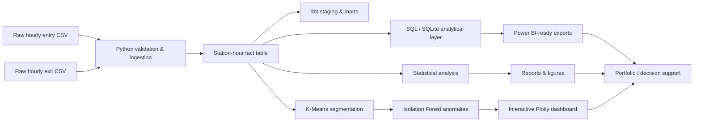

# London Underground Passenger Flow Analytics & Station Segmentation

An industry-style analytics portfolio project built from London Underground station-level hourly entry and exit data. The project converts an original statistics coursework notebook into a reproducible analytical pipeline with Python, SQL, dbt modelling, statistical inference, machine-learning segmentation, anomaly detection, automated tests, CI and dashboard-ready outputs.

## Executive results

- **268 stations** analysed across **21 hourly periods**.
- **5,628 station-hour records** / **11,256 entry-exit measurements**.
- **4,672,498 entries + 4,608,120 exits = 9,280,618 combined flow**.
- Network peak: **H08 = 999,624 combined entries/exits**.
- AM vs PM exit-share correlation: **Pearson r = -0.885, p = 2.52e-90**.
- PM exit share exceeds AM exit share by **9.16 percentage points on average**.
- Paired comparison: **t = -7.355, p = 2.35e-12; Cohen's dz = 0.449**.
- Three interpretable K-Means segments achieve **silhouette = 0.490**.
- Segmentation: **130 Residential-origin**, **85 Mixed-use/interchange**, **53 Employment-destination** stations.
- Isolation Forest flags **14 unusual station demand profiles** for investigation.
- Highest combined flows: **King's Cross St. Pancras (296,198)** and **Waterloo (296,136)**.

## Why this project exists

The original coursework focused mainly on station exits, peak-period proportions, descriptive statistics and a manually thresholded classification. The rebuilt version treats the files as a small analytical product: both entry and exit datasets are validated, normalised to station-hour grain, transformed into business metrics, queried through SQL, statistically tested, segmented through unsupervised learning and exposed as dashboard-ready outputs.

## Architecture



## Technology stack

**Analytics:** Python, Pandas, NumPy, SciPy, scikit-learn, Matplotlib, Plotly  
**Data / SQL:** SQL, SQLite, dbt project patterns, DuckDB/dbt-duckdb configuration  
**BI:** Power BI-ready star/semantic-layer outputs and DAX measures  
**Engineering:** Git/GitHub, pytest, GitHub Actions, modular Python packaging  
**Reproducibility:** Dockerfile included for containerised execution; container build should be validated in a Docker-enabled environment.

## Data model

The primary fact table is `fact_station_hourly_flow`, with one row per station and hour:

| Field | Meaning |
|---|---|
| Station | Underground station |
| hour_code | H05-H01 time bucket |
| entries | passengers entering the station |
| exits | passengers exiting the station |
| total_flow | entries + exits |
| net_arrivals | exits - entries |
| time_band | early / AM peak / interpeak / PM peak / evening / late |

The station analytical mart contains totals, peak shares, commuter-direction features, segments and anomaly scores.

## Core feature engineering

The project derives:

- daily entries, exits and combined footfall;
- AM-peak entries/exits (H07-H09);
- PM-peak entries/exits (H16-H18);
- entry and exit peak shares;
- entry/exit balance and ratio;
- peak concentration;
- net arrivals by hour;
- a normalised **employment-orientation score**:

```text
((AM exits - AM entries) + (PM entries - PM exits))
----------------------------------------------------
      AM entries + AM exits + PM entries + PM exits
```

Positive scores represent an employment-destination pattern; negative scores represent a residential-origin pattern.

## Statistical analysis

AM and PM station exit shares are strongly inversely associated:

- Pearson r = **-0.8851**
- Pearson p = **2.52e-90**
- Spearman rho = **-0.8774**

The PM exit share is systematically higher across stations:

- mean AM exit share = **20.71%**
- mean PM exit share = **29.87%**
- mean difference = **9.16 pp**
- paired t-test p = **2.35e-12**
- Wilcoxon p = **7.21e-13**
- paired Cohen's dz = **0.449**

These results improve on a visual-only histogram interpretation by quantifying both association and within-station peak differences.

## Station segmentation

K-Means was evaluated across K=2...6 using standardised directional peak features.

| K | Silhouette |
|---:|---:|
| 2 | 0.558 |
| **3** | **0.490** |
| 4 | 0.394 |
| 5 | 0.401 |
| 6 | 0.342 |

K=2 is mathematically strongest, while K=3 remains well-separated and provides a more useful operational taxonomy. The project therefore retains three interpretable segments:

| Segment | Stations | Mean employment score | Pattern |
|---|---:|---:|---|
| Residential-origin | 130 | -0.508 | high AM entries / high PM exits |
| Mixed-use/interchange | 85 | -0.089 | more balanced bidirectional flow |
| Employment-destination | 53 | +0.473 | high AM exits / high PM entries |

## Anomaly detection

Isolation Forest evaluates station volume, peak shares, directional balance and concentration. A 5% contamination threshold flags 14 stations for investigation. An anomaly is not automatically an error: it can represent a genuinely unusual interchange, business district, event-driven station or low-volume edge case.

## SQL and dbt

`sql/analytical_queries.sql` contains portfolio-ready SQL for:

- station ranking;
- network hourly demand;
- segment profiles;
- anomaly review;
- employment-oriented station analysis.

`dbt_analytics/` contains:

- seeds for entries/exits;
- staging models that reshape wide hourly columns to long form;
- an intermediate station-hour fact model;
- a station-level analytical mart;
- schema tests for uniqueness, nulls and accepted hour values;
- a DuckDB profile for local execution.

## Dashboard and Power BI

Running the Python pipeline generates:

- `dashboard/interactive_dashboard.html` — Plotly dashboard;
- `reports/figures/*.png` — static portfolio visuals;
- `data/processed/hourly_station_flow.csv` — Power BI fact export;
- `data/processed/station_metrics.csv` — station semantic-layer export;
- `power_bi/measures.dax` — reusable DAX measures;
- `power_bi/model.md` — relationship/report-page specification.

A `.pbix` binary is intentionally not claimed because Power BI Desktop is not available in this runtime.

## Repository layout

```text
.
├── data/
│   ├── raw/
│   └── processed/
├── dashboard/
├── dbt_analytics/
│   ├── models/
│   └── seeds/
├── notebooks/
│   └── archive/
├── power_bi/
├── reports/
│   └── figures/
├── sql/
├── src/tube_analytics/
├── tests/
├── .github/workflows/ci.yml
├── Dockerfile
├── Makefile
├── pyproject.toml
└── requirements.txt
```

## Run locally

```bash
python -m pip install -r requirements.txt
python -m pip install -e .
python -m tube_analytics.pipeline
pytest -q
```

Run dbt:

```bash
dbt seed --project-dir dbt_analytics --profiles-dir dbt_analytics
dbt run --project-dir dbt_analytics --profiles-dir dbt_analytics
dbt test --project-dir dbt_analytics --profiles-dir dbt_analytics
```

Build with Docker in a Docker-enabled environment:

```bash
docker build -t london-underground-analytics .
docker run --rm london-underground-analytics
```

## Validation status

The Python pipeline and tests were executed against the supplied raw data during the portfolio rebuild: **5/5 pytest tests passed**. The repository includes dbt/DuckDB and Docker configuration, but those components could not be executed in the current environment because the required local packages/container daemon are unavailable. GitHub Actions is configured to execute the full Python + dbt validation when the repository is hosted on GitHub.

## Limitations

The source notebook describes the data as 2017 regular-weekday London Underground usage. The data is station/hour aggregated and provides no passenger-level journey linking, demographics, geographic coordinates or verified land-use labels. Commuter segment names are analytical interpretations and should not be treated as official TfL station classifications.

## Portfolio positioning

This project demonstrates an end-to-end analytics workflow rather than only notebook EDA: data-quality controls, feature engineering, statistical inference, SQL, dimensional/mart design, dbt conventions, unsupervised ML, anomaly detection, BI-ready outputs, testing, CI and reproducibility.
